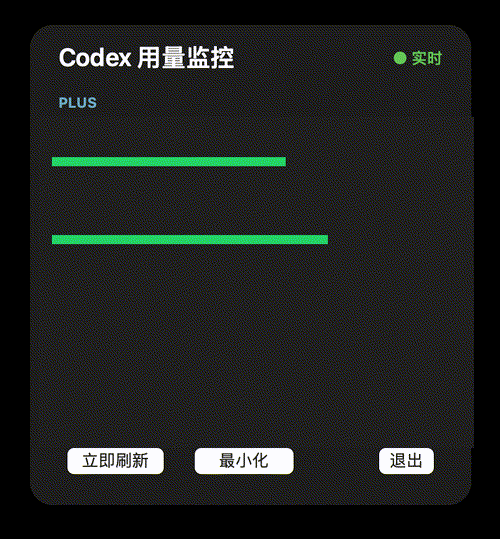

# Codex Usage Monitor


一个开源的 Codex 用量监控器：在 Codex 中查询套餐余额和 Token 活动，也可以通过 macOS 菜单栏与悬浮面板持续查看 5 小时/7 天窗口。

> 社区工具，非 OpenAI 官方产品。项目由 [qcodingdev](https://github.com/qcodingdev) 维护。

## 使用效果



上图是经过遮盖处理的示例动画，仅用于展示悬浮窗布局和刷新效果，不包含真实账号用量、日期、桌面窗口或登录信息。

## 功能

- 读取 5 小时和 7 天用量窗口、剩余比例和重置时间。
- 显示套餐类型、Credits、今日 Token、累计 Token 和活跃信息。
- 同时支持 Codex Desktop 和 Codex CLI 共用的本地账户数据。
- macOS 菜单栏、可拖动悬浮窗、最小化和退出控制。
- CLI 不存在时自动尝试 ChatGPT.app 内置的 `codex`；两者都不存在才提示错误。
- 只调用本地 app-server 的只读方法，不抓取网页、不读取登录文件。

## 当前版本

| 版本 | 状态 | 支持平台 |
| --- | --- | --- |
| v0.1.1 | macOS MVP | macOS 13+；Universal 构建，支持 Intel 与 Apple Silicon |
| Windows | 规划中 | 尚未发布 |

## 安装

### macOS 桌面程序

从 [Releases](https://github.com/qcodingdev/codex-usage-monitor/releases) 下载 `Codex-Usage-Monitor-macOS.zip`，解压后双击 `Install Codex Usage Monitor.command`。安装程序会：

- 把应用放入 `~/Applications`，以后可通过 Spotlight 或“应用程序”重新打开。
- 安装 `~/.local/bin/codex-usage-monitor` 命令。
- 安装完成后立即启动监控器。

如果 `~/.local/bin` 已在 PATH 中，可以从终端直接运行：

```bash
codex-usage-monitor
```

也支持：

```bash
codex-usage-monitor status
codex-usage-monitor location
```

“最小化”只隐藏面板，点击 macOS 菜单栏中的仪表图标即可恢复；“完全退出”会停止程序，之后可从应用程序或 CLI 重新启动。

### Codex 插件

将 `plugin/` 目录作为本地插件安装，或下载 Release 中的 `codex-usage-monitor-plugin.zip`。安装后可以直接询问：

> 查看我的 Codex 套餐余额、窗口重置时间和 Token 活动。

需要启动浮窗时运行：

```bash
zsh plugin/scripts/launch-monitor.sh
```

## 隐私与安全

- 数据只在本机读取，不上传到本项目或第三方服务器。
- 不读取、复制或保存 ChatGPT/Codex 登录凭据。
- 只调用 `account/rateLimits/read` 和 `account/usage/read`。
- 不调用登录、退出、重置 Credits 或其他账户变更方法。
- Codex app-server 属于本地产品接口，未来版本可能调整返回字段；遇到变化请提交 Issue。

## 性能

应用不运行模型任务，只保持一个本地 app-server 并定时发送两次只读请求。开发机空闲实测约为应用 30 MB、app-server 80 MB、CPU 接近 0%；实际数值会随 Codex 版本变化。它不会额外消耗模型 Token 或套餐额度。

## 从源码构建

macOS 需要 Xcode Command Line Tools 或 Swift 工具链：

```bash
cd apps/macos
chmod +x build.sh
./build.sh
```

产物位于 `apps/macos/build/`。GitHub Actions 会在打 tag 后自动构建 macOS 应用并生成 Release 附件。

## 版本路线

- `v0.1.1`：macOS 安装与 CLI 启动入口。
- `v0.2.0`：Windows 规划中。
- `v0.3.0`：跨平台安装器、签名和自动更新。
- `v1.0.0`：稳定协议适配和官方插件提交准备。

## 贡献

请先阅读 [CONTRIBUTING.md](CONTRIBUTING.md)。欢迎提交兼容性报告、界面改进和 Windows 实现，但请不要提交账号数据、Token 或本地日志。

## 许可证

[MIT](LICENSE)
